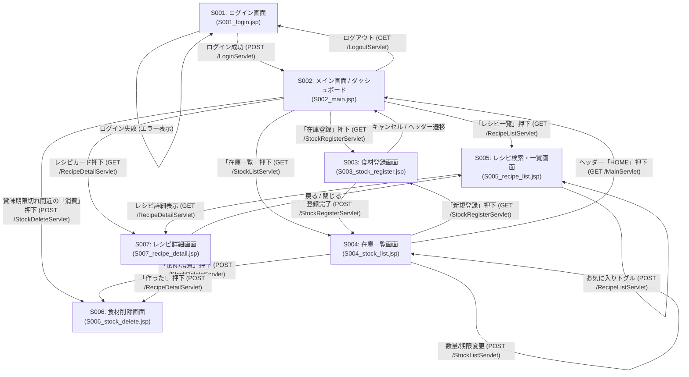
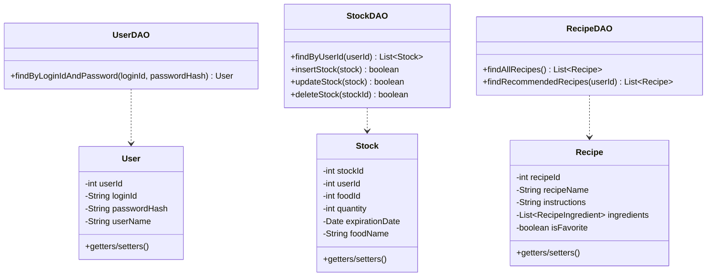
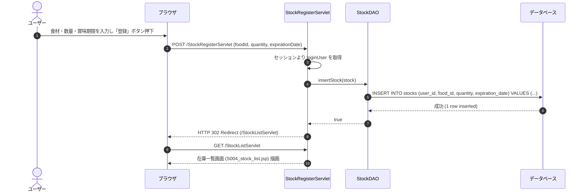

# 冷蔵庫在庫管理＆レシピ提案システム

家庭内における食品廃棄（フードロス）の削減および毎日の献立作成支援を目的とした、冷蔵庫の在庫管理および在庫に基づくレシピ提案を行うWebアプリケーションです。

> [!NOTE]  
> **本プロジェクトは、Java実習時に作成したコンテンツ（ポートフォリオ）です。**  
> * **開発期間**: 26日  (要件定義、PD、PG)
> * **開発規模**: 1.7Kstep  

---
---

## 🌐 動作確認（デモ環境）

AWS上にデプロイしており、実際に動作をご確認いただけます。

👉 **[「冷蔵庫コンシェルジュ」デモサイトはこちら](http://13.193.142.78/hiyoko/)**  
*(※別タブで開く場合は `Ctrl + クリック` / `Cmd + クリック` 推奨)*

> **テスト用ログイン情報**  
> * **ID**: `aaaa`  
> * **パスワード**: `1234`

---

## 📖 目次
- [プロジェクト概要](#-プロジェクト概要)
- [システムの特徴・主要機能](#-システムの特徴主要機能)
- [技術スタック](#-技術スタック)
- [システムアーキテクチャ・設計](#-システムアーキテクチャ設計)
  - [画面構成・画面遷移図](#画面構成画面遷移図)
  - [データベース設計 (ER/テーブル定義)](#データベース設計-erテーブル定義)
  - [API・サーブレット仕様](#apiサーブレット仕様)
  - [クラス設計](#クラス設計)
  - [処理フロー・シーケンス図](#処理フローシーケンス図)
- [画面一覧](#-画面一覧)
- [今後の拡張機能](#-今後の拡張機能)
- [プロジェクトリンク](#-プロジェクトリンク)

---

## 📌 プロジェクト概要

### (1) 背景
家庭内における食材の買いすぎや、賞味期限切れに伴うフードロス（食品廃棄）が深刻な社会課題となっています。日本のフードロス発生量は年間約472万トン（令和4年度推計）であり、その約半分は家庭から発生しています。

### (2) 目的
家庭で保有・保管している食材をWeb上で一元管理し、数量や賞味期限を直感的に把握できるようにします。

### (3) 目標
登録された食材在庫データを基に、賞味期限の近い食材を活用できるレシピを自動検索・推薦し、食品の使い忘れや廃棄削減に貢献します。

### (4) ターゲットユーザー
- 自炊頻度が高く、家庭内の食品管理や毎日の献立作成に悩む一般ユーザー
- 共働き世帯、単身世帯、およびフードロス削減・家計節約の意識が高いユーザー

---

## 💫 システムの特徴・主要機能

1. **賞味期限アラート＆ダッシュボード (メイン画面)**
   - ログイン後、賞味期限が近い食材（3日以内）をアラートとして強調表示。
   - アラート食材を消費できるおすすめレシピを動的に抽出して提案。

2. **直感的な食材登録 (新規登録画面)**
   - カテゴリ選択（野菜・肉・魚・お菓子・嗜好品など）と連動したスムーズな登録。
   - 野菜カテゴリの自動賞味期限計算（+7日）や未入力時の補完・アラート機能を搭載。

3. **フレキシブルな在庫管理 (在庫確認画面)**
   - 保有食材の一覧表示、数量や賞味期限の一括編集（直書き）、およびチェックボックスによる削除・消費管理。

4. **スマートなレシピ提案＆自動消費機能 (おすすめレシピ / レシピ詳細 / 食品削除画面)**
   - 賞味期限切れが近い食材を優先したレシピ推薦アルゴリズム。
   - レシピ選択から「作」（調理実行）ボタンを押下することで、使用した食材を在庫から自動消費・削除。
   - お気に入りレシピ（☆/★）の登録・管理機能。

---

## 🛠 技術スタック

| レイヤ | 技術 / ツール | 役割・備考 |
| :--- | :--- | :--- |
| **バックエンド** | Java 17+, Servlet / JSP | ビジネスロジック実装、セッション管理、ルーティング |
| **フロントエンド** | HTML5, CSS3, JavaScript (Vanilla JS) | UI/UX描画、ダイアログ制御、モーダル・画面遷移演出 |
| **データベース** | PostgreSQL 16+ | ユーザー、在庫、食材マスタ、レシピ等のリレーショナルデータ管理 |
| **ビルド・ライブラリ** | Jakarta EE (Servlet 6.0 / JSTL 3.0), PostgreSQL JDBC | Webコンテナ依存関係およびDBバインディング |

---

## 🏗 システムアーキテクチャ・設計

### 画面構成・画面遷移図

本システムは以下の9画面・機能モジュールで構成されています。

---

### データベース設計 (ER/テーブル定義)

#### テーブル一覧
1. **ユーザー (`public.users`)**: ログイン認証情報を保持
2. **在庫一覧 (`public.stocks`)**: ユーザーが保有する食材、数量、賞味期限を保持
3. **食材カテゴリマスタ (`public.food_categories`)**: 食材の大分類情報を保持
4. **食材マスタ (`public.food_master`)**: 各カテゴリに属する標準食品名・単位情報を保持
5. **レシピマスタ (`public.recipes`)**: レシピ基本情報（名称、作り方、画像等）を保持
6. **レシピ食材 (`public.recipe_ingredients`)**: 各レシピに必要な食材と分量マッピング
7. **お気に入り一覧 (`public.favorite_recipes`)**: ユーザーごとのお気に入りレシピ参照

#### 主要テーブル構造 (物理設計)

| テーブル名 | カラム名 | 型 | 制約 | 説明 |
| :--- | :--- | :--- | :--- | :--- |
| **users** | `user_id` | SERIAL | PRIMARY KEY | ユーザーID |
| | `login_id` | VARCHAR(50) | UNIQUE, NOT NULL | ログインID |
| | `password_hash` | VARCHAR(255) | NOT NULL | パスワードハッシュ値 |
| | `user_name` | VARCHAR(100) | NOT NULL | ユーザー表示名 |
| **stocks** | `stock_id` | SERIAL | PRIMARY KEY | 在庫ID |
| | `user_id` | INT | FOREIGN KEY | 所有ユーザーID |
| | `food_id` | INT | FOREIGN KEY | 食品マスタID |
| | `quantity` | INT | NOT NULL | 保有数量 |
| | `expiration_date` | DATE | NOT NULL | 賞味期限 |
| **recipes** | `recipe_id` | SERIAL | PRIMARY KEY | レシピID |
| | `recipe_name` | VARCHAR(100) | NOT NULL | レシピ名称 |
| | `instructions` | TEXT | | 調理手順 |

---

### API・サーブレット仕様

| エンドポイント | HTTPメソッド | 機能概要 | 主な処理 / 遷移動作 |
| :--- | :--- | :--- | :--- |
| `/IndexServlet` | GET | 初期アクセスルーティング | セッション状態に応じたメイン / ログイン振り分け |
| `/LoginServlet` | GET / POST | ログイン認証 | 認証成功 ➔ `/MainServlet` へリダイレクト |
| `/LogoutServlet` | GET / POST | ログアウト | セッションを破棄しログイン画面へ遷移 |
| `/MainServlet` | GET | メインダッシュボード表示 | 期限切近在庫および推薦レシピ3件の取得 |
| `/StockRegisterServlet` | GET / POST | 食材在庫の新規登録 | 在庫登録実行 ➔ `/StockListServlet` へリダイレクト |
| `/StockListServlet` | GET / POST | 在庫一覧表示・一括更新 | 保有在庫一覧表示、数量・賞味期限の一括更新 |
| `/StockDeleteServlet` | GET / POST | 食材在庫の削除・消費 | 指定在庫レコードの物理削除 |
| `/RecipeListServlet` | GET / POST | レシピ一覧表示・検索 | 全レシピ表示、お気に入り状態の切替 |
| `/RecipeDetailServlet` | GET / POST | レシピ詳細表示・調理実行 | レシピ詳細表示、「このレシピを作る」食材自動消費 |

---

### クラス設計

---

### 処理フロー・シーケンス図

#### 在庫登録処理シーケンス

---

## 🖥 画面一覧

1. **ログイン画面 (`S001_login.jsp`)**
   - ユーザーIDおよびパスワードによる認証画面。
2. **メイン画面 / ダッシュボード (`S002_main.jsp`)**
   - 賞味期限間近のアラート食材およびおすすめレシピ提案画面。
3. **新規登録画面 (`S003_stock_register.jsp`)**
   - カテゴリ・食材選択、数量・賞味期限の入力画面。
4. **在庫確認画面 (`S004_stock_list.jsp`)**
   - 現在の冷蔵庫内在庫の一覧表示、編集（閲覧/編集モード切替）、削除操作画面。
5. **おすすめレシピ画面 (`S005_recipe_list.jsp`)**
   - 在庫食材に基づいた推薦レシピおよび全レシピ検索一覧画面。
6. **食品削除画面 (`S006_stock_delete.jsp`)**
   - 調理等で消費した食材を選択して一括削除する画面。
7. **レシピ詳細画面 (`S007_recipe_detail.jsp`)**
   - レシピの材料・手順詳細表示および「このレシピを作る」調理消費実行画面。

---

## 🚀 今後の拡張機能

- **ユーザー認証・アカウント管理の拡張**
  - サインアップ（新規ユーザー登録）機能およびパスワードハッシュ（BCrypt等）の高度化。
- **最安値食材自動取得・表示 (Webスクレイピング)**
  - Seleniumを活用し、近隣スーパーやECサイトから特売価格データを自動取得・比較表示。
- **賞味期限リマインド通知**
  - 賞味期限が直前に迫った食材情報を登録メールアドレスへ定期配信するバッチ機能。

 [💡 工夫した点](#-工夫した点)

      　要件定義書の作成に時間をかけた。
      　機能一覧（PD資料）の作成を極細分化し、GoogleAntiGravityへの指示に工夫を凝らした。
      　ワイヤーフレームを緻密に作成、GoogleAntiGravityへの指示の際、AIが混同しない方法を採用。

 [💡 苦労した点・得られた教訓](#-苦労した点得られた教訓)

      　GoogleAntiGravityへの生成に計12度実行
      プログラムの起動を軽快にする為、データベースへのアクセス方法を繰り返し検討した。

---

>Java実習の内容は以下よりご覧いただけます。 
> 👉 **[Java実習の内容はこちら](https://github.com/hadano-nobuyuki/ai-programming-training-portfolio)**  

